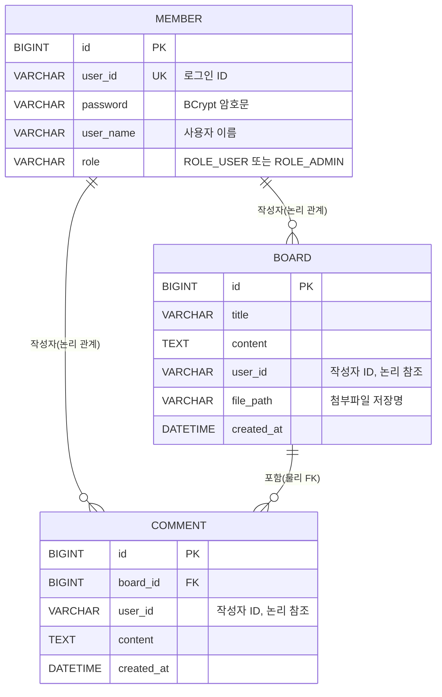
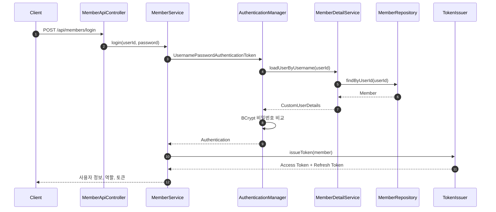
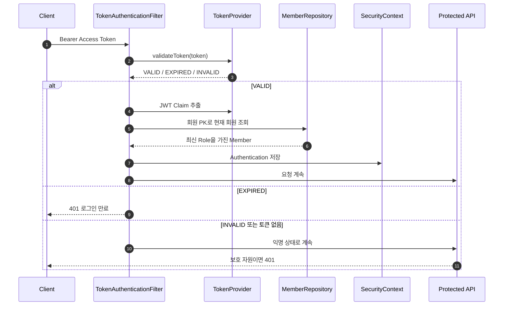

# Basic Board Token

Spring Security와 JWT를 이용해 인증·인가를 구현한 게시판 REST API 프로젝트입니다.  
일반 사용자는 게시글과 댓글을 작성하고 본인이 작성한 데이터만 수정·삭제할 수 있으며, 관리자는 전체 게시글·댓글 관리, 작성자 통계 조회, 회원 권한 변경이 가능합니다.

> 이 문서는 백엔드 API, 데이터 모델, Spring Security 구성만 다룹니다. 기존 Thymeleaf 및 별도 프론트엔드 코드는 설명 대상에서 제외합니다.

## 핵심 기능

- 회원가입 및 BCrypt 비밀번호 암호화
- Access Token / Refresh Token 발급
- JWT 기반 Stateless 인증
- 게시글 작성·조회·검색·수정·삭제
- 댓글 작성·삭제
- 작성자 또는 관리자 기반 수정·삭제 권한 검사
- 관리자 전용 작성자 통계
- 관리자 전용 회원 목록 및 권한 변경
- QueryDSL 기반 동적 검색과 집계
- 파일 업로드 및 다운로드

## 기술 스택

| 구분 | 기술 |
|---|---|
| Language | Java 25 |
| Framework | Spring Boot 4.1.0 |
| Security | Spring Security, JWT(JJWT 0.13.0) |
| Persistence | Spring Data JPA, Hibernate |
| Query | QueryDSL |
| Database | MySQL |
| Build | Gradle |
| ETC | Lombok |

---

## ERD



### 관계 설명

#### Board와 Comment

`comment.board_id`는 `board.id`를 참조하는 실제 외래 키입니다.

```text
BOARD 1 ───── N COMMENT
```

- 하나의 게시글은 여러 댓글을 가질 수 있습니다.
- 하나의 댓글은 반드시 하나의 게시글에 속합니다.
- `ON DELETE CASCADE`가 설정되어 게시글 삭제 시 해당 댓글도 함께 삭제됩니다.
- JPA에서는 `Board.comments`와 `Comment.board`로 양방향 관계를 구성합니다.
- 댓글이 없는 게시글도 조회할 수 있도록 상세 조회 시 `left join fetch`를 사용합니다.

#### Member와 Board·Comment

`board.user_id`와 `comment.user_id`는 `member.user_id`를 작성자 식별자로 사용하지만 DB 외래 키나 JPA 연관관계는 설정하지 않았습니다.

```text
MEMBER.user_id ← BOARD.user_id
MEMBER.user_id ← COMMENT.user_id
```

즉, 작성자 관계는 문자열 ID를 이용한 논리적 관계입니다. 이 구조는 조회가 단순하지만 DB가 참조 무결성을 직접 보장하지 않으므로, 작성자 ID는 반드시 인증된 사용자 정보에서 생성해야 합니다. 본 프로젝트는 요청 DTO의 사용자 ID를 신뢰하지 않고 `SecurityContext`의 로그인 사용자 ID를 저장합니다.

### 테이블 상세

#### `member`

| 컬럼 | 타입 | 제약조건 | 설명 |
|---|---|---|---|
| `id` | BIGINT | PK, AUTO_INCREMENT | 회원 식별자 |
| `user_id` | VARCHAR(50) | NOT NULL, UNIQUE | 로그인 ID |
| `password` | VARCHAR(100) | NOT NULL | BCrypt 암호문 |
| `user_name` | VARCHAR(50) | NOT NULL | 사용자 이름 |
| `role` | VARCHAR(50) | NOT NULL | `ROLE_USER`, `ROLE_ADMIN` |

#### `board`

| 컬럼 | 타입 | 제약조건 | 설명 |
|---|---|---|---|
| `id` | BIGINT | PK, AUTO_INCREMENT | 게시글 식별자 |
| `title` | VARCHAR(200) | NOT NULL | 제목 |
| `content` | TEXT | NOT NULL | 본문 |
| `user_id` | VARCHAR(50) | NOT NULL | 작성자 로그인 ID |
| `file_path` | VARCHAR(255) | NULL 허용 | 서버에 저장된 파일명 |
| `created_at` | DATETIME | NOT NULL | 작성 시각 |

#### `comment`

| 컬럼 | 타입 | 제약조건 | 설명 |
|---|---|---|---|
| `id` | BIGINT | PK, AUTO_INCREMENT | 댓글 식별자 |
| `board_id` | BIGINT | FK, NOT NULL | 대상 게시글 |
| `user_id` | VARCHAR(50) | NOT NULL | 작성자 로그인 ID |
| `content` | TEXT | NOT NULL | 댓글 내용 |
| `created_at` | DATETIME | NOT NULL | 작성 시각 |

---

## Spring Security 구성

### 전체 구조

```mermaid
flowchart LR
    Client["Client"] -->|"Authorization: Bearer JWT"| Filter["TokenAuthenticationFilter"]
    Filter --> Provider["TokenProvider"]
    Provider -->|"서명·만료 검증"| Claims["JWT Claims"]
    Claims --> MemberRepo["MemberRepository"]
    MemberRepo -->|"현재 회원·권한 조회"| Principal["CustomUserDetails"]
    Principal --> Context["SecurityContextHolder"]
    Context --> Security["URL / Method Security"]
    Security --> Controller["Controller"]
    Controller --> Service["Service 권한 검사"]
```



Security는 다음 세 단계로 권한을 검사합니다.

1. `TokenAuthenticationFilter`가 JWT를 검증하고 인증 객체를 생성합니다.
2. `SecurityFilterChain`과 `@PreAuthorize`가 URL·메서드 단위 권한을 검사합니다.
3. 서비스가 게시글·댓글의 실제 작성자와 로그인 사용자를 비교합니다.

화면에서 버튼을 숨기는 것과 무관하게 최종 권한은 서버에서 검사합니다.

### SecurityFilterChain

`SecurityConfig`의 주요 설정은 다음과 같습니다.

| 설정 | 내용 |
|---|---|
| CSRF | 비활성화 |
| Form Login | 비활성화 |
| HTTP Basic | 비활성화 |
| Logout Filter | 비활성화 |
| Session | `STATELESS` |
| Password Encoder | `BCryptPasswordEncoder` |
| Method Security | `@EnableMethodSecurity` |
| JWT Filter | `UsernamePasswordAuthenticationFilter` 앞에 배치 |
| CORS | 로컬 개발 Origin과 API 요청 헤더 허용 |

JWT를 사용하는 REST API이므로 서버 세션에 로그인 상태를 저장하지 않습니다. 매 요청마다 Access Token을 검증해 사용자를 인증합니다.

### 공개 경로

다음 API는 인증 없이 접근할 수 있습니다.

```text
POST /api/members/join
POST /api/members/login
```

로그인·회원가입 API는 `TokenAuthenticationFilter.shouldNotFilter()`에서도 제외합니다. 브라우저에 만료된 토큰이 남아 있더라도 다시 로그인할 수 있게 하기 위한 처리입니다.

그 외 API는 기본적으로 인증이 필요합니다.

### 로그인 인증 과정



1. 아이디와 비밀번호로 `AuthenticationManager`에 인증을 요청합니다.
2. `MemberDetailService`가 회원을 조회해 `CustomUserDetails`로 변환합니다.
3. Spring Security가 입력 비밀번호와 BCrypt 암호문을 비교합니다.
4. 인증 성공 시 Access Token과 Refresh Token을 발급합니다.
5. 이후 요청은 `Authorization: Bearer {accessToken}` 헤더를 사용합니다.

### JWT 구성

토큰은 HS512 알고리즘으로 서명합니다.

| Claim | 값 |
|---|---|
| `iss` | 토큰 발급자 |
| `iat` | 발급 시각 |
| `exp` | 만료 시각 |
| `sub` | 회원의 `userId` |
| `id` | 회원 PK |
| `name` | 회원 이름 |
| `role` | `ROLE_USER` 또는 `ROLE_ADMIN` |

기본 유효시간:

- Access Token: 2시간
- Refresh Token: 7일

### 요청 인증 과정



JWT의 역할 값만 그대로 신뢰하지 않고, 토큰의 회원 PK로 DB를 다시 조회합니다. 따라서 관리자가 회원 역할을 변경하면 다음 API 요청부터 최신 역할이 반영됩니다.

### UserDetails와 권한

`CustomUserDetails`는 `Member`를 Spring Security 인증 주체로 감쌉니다.

```text
Member.role
   └─ SimpleGrantedAuthority
      ├─ ROLE_USER
      └─ ROLE_ADMIN
```

역할 계층은 다음과 같습니다.

```text
ROLE_ADMIN > ROLE_USER
```

관리자는 일반 사용자 권한을 모두 포함합니다.

---

## 인가 정책

| 기능 | 비로그인 | `ROLE_USER` | `ROLE_ADMIN` |
|---|---:|---:|---:|
| 회원가입·로그인 | 허용 | 허용 | 허용 |
| 게시글 목록·검색·상세 | 불가 | 허용 | 허용 |
| 게시글 작성 | 불가 | 허용 | 허용 |
| 본인 게시글 수정·삭제 | 불가 | 허용 | 허용 |
| 타인 게시글 수정·삭제 | 불가 | 불가 | 허용 |
| 댓글 작성 | 불가 | 허용 | 허용 |
| 본인 댓글 삭제 | 불가 | 허용 | 허용 |
| 타인 댓글 삭제 | 불가 | 불가 | 허용 |
| 작성자 통계 조회 | 불가 | 불가 | 허용 |
| 회원 목록 조회 | 불가 | 불가 | 허용 |
| 회원 역할 변경 | 불가 | 불가 | 허용 |

### 게시글 권한 검사

게시글 수정과 삭제는 다음 조건 중 하나를 만족해야 합니다.

```text
로그인 회원이 ROLE_ADMIN
OR
게시글.userId == 로그인 회원.userId
```

게시글 조회는 로그인 사용자라면 작성자와 관계없이 가능합니다.

### 댓글 권한 검사

댓글 삭제도 같은 원칙을 사용합니다.

```text
로그인 회원이 ROLE_ADMIN
OR
댓글.userId == 로그인 회원.userId
```

게시글·댓글 작성자의 `userId`는 클라이언트 요청값이 아니라 `SecurityContextHolder`의 인증 사용자에서 가져옵니다. 따라서 다른 사용자의 ID를 요청에 넣어 작성자를 위조할 수 없습니다.

### 관리자 전용 메서드

다음 API는 `@PreAuthorize("hasRole('ADMIN')")`로 보호합니다.

```text
GET   /api/boards/stats/authors
GET   /api/members
PATCH /api/members/{memberId}/role
```

---

## API

모든 보호 API 요청에는 다음 헤더가 필요합니다.

```http
Authorization: Bearer {accessToken}
```

### 회원

| Method | Endpoint | 설명 | 권한 |
|---|---|---|---|
| POST | `/api/members/join` | 회원가입 | Public |
| POST | `/api/members/login` | 로그인 및 JWT 발급 | Public |
| GET | `/api/members` | 회원 목록 | ADMIN |
| PATCH | `/api/members/{memberId}/role` | 관리자 승급·해제 | ADMIN |

회원가입 요청:

```json
{
  "userId": "new-user",
  "password": "1234",
  "userName": "새 사용자"
}
```

로그인 요청:

```json
{
  "userId": "user",
  "password": "1234"
}
```

로그인 성공 응답의 핵심 필드:

```json
{
  "isLoggedIn": true,
  "userId": "user",
  "username": "일반사용자",
  "role": "ROLE_USER",
  "accessToken": "...",
  "refreshToken": "...",
  "message": "로그인에 성공했습니다"
}
```

권한 변경 요청:

```json
{
  "role": "ROLE_ADMIN"
}
```

### 게시글

| Method | Endpoint | 설명 | 권한 |
|---|---|---|---|
| GET | `/api/boards` | 게시글 목록 | 로그인 |
| GET | `/api/boards/search` | 조건 검색 및 페이징 | 로그인 |
| GET | `/api/boards/{id}` | 게시글·댓글 상세 | 로그인 |
| POST | `/api/boards` | 게시글 작성 | 로그인 |
| PUT | `/api/boards/{id}` | 게시글 수정 | 작성자 또는 ADMIN |
| DELETE | `/api/boards/{id}` | 게시글 삭제 | 작성자 또는 ADMIN |
| GET | `/api/boards/file/download/{fileName}` | 첨부파일 다운로드 | 로그인 |
| GET | `/api/boards/stats/authors` | 작성자별 게시글 통계 | ADMIN |

게시글 작성과 수정은 `multipart/form-data`를 사용합니다.

```text
title: 게시글 제목
content: 게시글 본문
file: 첨부파일(선택)
fileFlag: 수정 시 파일 변경 여부
```

검색 조건:

```text
title   제목 부분 일치
userId 작성자 ID 정확히 일치
from   시작 날짜
to     종료 날짜
page   페이지 번호, 기본 1
size   페이지 크기, 기본 10
```

QueryDSL은 입력되지 않은 조건을 `null`로 반환하여 동적으로 제외합니다.

### 댓글

| Method | Endpoint | 설명 | 권한 |
|---|---|---|---|
| POST | `/api/boards/{boardId}/comments` | 댓글 작성 | 로그인 |
| DELETE | `/api/boards/{boardId}/comments/{commentId}` | 댓글 삭제 | 작성자 또는 ADMIN |

댓글 작성 요청:

```json
{
  "content": "댓글 내용"
}
```

---

## QueryDSL 사용

게시글 검색은 다음 조건을 동적으로 조합합니다.

- 제목 포함 검색
- 작성자 ID 검색
- 시작일 이상
- 종료일 이하
- 최신 게시글 우선 정렬
- 페이징
- 게시글별 댓글 수 서브쿼리
- 회원 테이블 조인을 통한 작성자 이름 조회

관리자 통계는 작성자별 게시글 수를 집계합니다.

```text
GROUP BY board.user_id, member.user_name
HAVING COUNT(board.id) >= minCount
ORDER BY COUNT(board.id) DESC
```

---

## 예외 응답

API 오류는 다음 형식으로 반환합니다.

```json
{
  "status": 403,
  "message": "게시글 수정/삭제 권한이 없습니다."
}
```

| Status | 상황 |
|---:|---|
| 400 | 잘못된 JSON, 요청값 또는 상태 변경 |
| 401 | 로그인 실패, 인증 누락, 토큰 만료 |
| 403 | 작성자·관리자 권한 부족 |
| 404 | 게시글을 찾을 수 없음 |
| 409 | 중복 아이디 |
| 500 | 예상하지 못한 서버 오류 |

---

## 실행 방법

### 요구사항

- JDK 25
- MySQL
- Gradle Wrapper 사용 가능 환경

### 데이터베이스 생성

```sql
CREATE DATABASE java_basic
CHARACTER SET utf8mb4
COLLATE utf8mb4_unicode_ci;
```

기본 연결 설정:

```yaml
spring:
  datasource:
    url: jdbc:mysql://localhost:3306/java_basic
    username: root
    password: qwer1234
```

`src/main/resources/data.sql`에는 테이블 생성문과 테스트 데이터가 포함되어 있습니다. 외부 MySQL에서는 환경에 따라 자동 실행되지 않을 수 있으므로 직접 실행하거나 다음 설정을 추가합니다.

```yaml
spring:
  sql:
    init:
      mode: always
```

> `data.sql`은 기존 테이블을 삭제하고 다시 생성하므로 운영 데이터베이스에서는 실행하면 안 됩니다.

### 애플리케이션 실행

```bash
./gradlew bootRun
```

기본 주소:

```text
http://localhost:8080
```

### 테스트 계정

초기 데이터의 비밀번호는 모두 `1234`입니다.

| ID | 이름 | 역할 |
|---|---|---|
| `test` | 관리자 | `ROLE_ADMIN` |
| `user` | 일반사용자 | `ROLE_USER` |

---

## 패키지 구조

```text
com.example.basicboard_token
├── config
│   ├── dsl                 # QueryDSL 설정
│   ├── filter              # JWT 인증 필터
│   ├── jwt                 # 토큰 생성·검증, JWT 설정
│   └── security            # SecurityFilterChain, UserDetails
├── controller              # REST API Controller
├── domain
│   ├── entity              # Member, Board, Comment, Role
│   └── repository          # JPA 및 QueryDSL Repository
├── dto
│   ├── request
│   └── response
├── exception               # 전역 예외 처리
├── mapper                  # Entity ↔ DTO 변환
├── service                 # 비즈니스 및 권한 검사
│   └── component           # 토큰, 파일, 게시글 처리 컴포넌트
└── util
```
